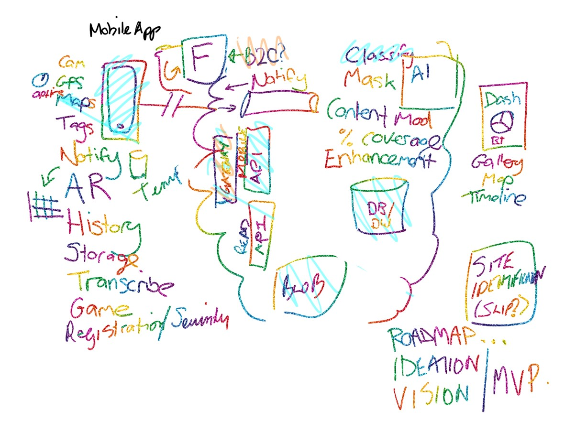

# Monitoring Environmental Rehabilitation
Code produced as an outcome of the Perth Hack for Good: Monitoring Environmental Rehabilitation.

The purpose of the hack was to produce a skeleton solution that could be evolved over time to include more features with the ultimate aim of submitting the application to the main mobile app stores.

## Building an Architecture with a Rainbow Pen! 

## Event Detials
The Perth Hack for Good is about getting a group of like-minded people together to solve a real world problem and learn some skills in a collaborative way.

Hosted by Microsoft the hackathon will begin on Friday evening where we state the problem, meet our team mates and brainstorm ideas. On Saturday we will spend the day collaborating and coding and by the end we hope to have a skeleton solution that can be open sourced to allow ongoing development.

We welcome anyone to the event, some knowledge of coding and web or mobile development is certainly encouraged but the main emphasis is on having fun and learning new skills.
